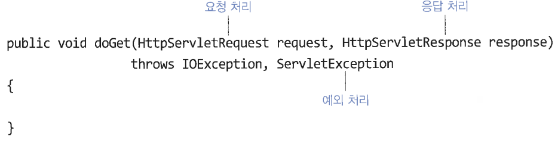
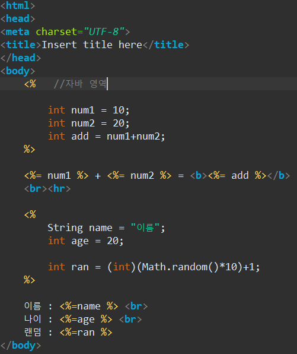

# 설치/설정

tomcat download ( tomcat 9 / 64비트.zip)

sqldeveloper : 자바폴더안에  설치

이클립스 > 윈도우 > preferences > runtime > apache

preferences > enc >  workspace, web 전체, XML  을 UTF-8

dynamic web project > 버전9.0확인 > next후 generate 체크

response.setContentType("text/html; charset=utf-8");    >> 필수_없으면 한글깨진다.

# 주요 용어

전송 방식

request : 여러가지 메소드

response : 클라이언트의 정보

servlet : ( server + applet ) 서블릿

# 구조

# 출력

# forward
.png)