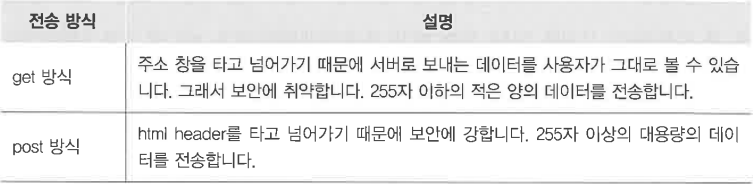

# 설치/설정

tomcat download ( tomcat 9 / 64비트.zip)

sqldeveloper : 자바폴더안에  설치

이클립스 > 윈도우 > preferences > runtime > apache

preferences > enc >  workspace, web 전체, XML  을 UTF-8

dynamic web project > 버전9.0확인 > next후 generate 체크

response.setContentType("text/html; charset=utf-8");    >> 필수_ 없으면 한글깨진다.

# 주요 용어

전송 방식

request : 여러가지 메소드

response : 클라이언트의 정보

servlet : ( server + applet ) 서블릿

# 구조

/Test 어노테이션으로 URL 매핑

실제 서블릿 클래스 이름을 공개하지 않기 위해서

( http://localhost8181/web-study-02/Test )

# 출력

# forward

# input type 종류
# 

1. **input type = "text" , input type = "password"** 
    
2. **input type = "radio"** 
    
3. **input type = "checkbox"**
    
4. **select option**
    
5. **input type ="button" ,input type = "submit", input type = "reset"**
    
6. **input type ="image"** 
    
7. **input type ="file"**
    

    

29일차